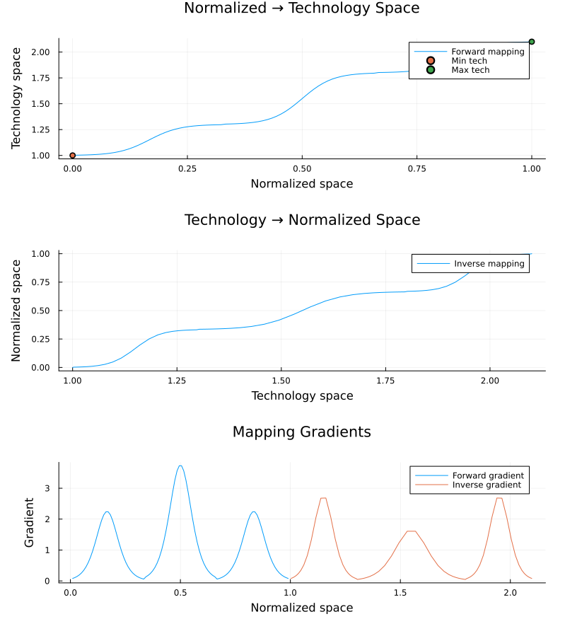

# Integration of Portfolio Model with GE Solver

## Background

The original implementation attempted to have the GE solver optimize over vintage portfolios (v_t) directly for each combination of At and eta_t to solve for Aeff_t and eta_eff_t. This proved challenging and didn't properly capture portfolio dynamics.

## Current Setup

1. Portfolio dynamics are pre-computed in a separate module (Portfolio_model.jl)
2. This generates a sequence vector containing all valid portfolio sequences across periods
3. Each sequence provides moments (Aeff_t, eta_eff_t) for each period
4. The sequence space shows clear linear/curve relationships in (A_eff, η_eff) space
5. Current period choices constrain future period domains

## Fundamental Challenge: Discrete Technology Space

A key limitation exists in the model structure:

1. Technologies are defined as discrete (A, η) pairs:

```julia
tech0 = TechnologySet(
A=[1.4, 1.1, 1.3], # discrete points
η=[0.7, 0.9, 1.0] # discrete points
)
```

2. Even with:
   - Continuous weight distributions (Dirichlet sampling)
   - Continuous operation modes
   - Continuous splits between old and new capital

3. The resulting A_eff, η_eff values:
   - Can only be convex combinations of the discrete technology points
   - Are constrained to the convex hull of available technologies
   - May have "unreachable" regions between technology points
   - Cannot guarantee continuous coverage between min(tech_t) and max(tech_t)

This discreteness is inherent to the model structure and must be considered in the solver approach.

## Integration Approaches


## Proposed Solution: Domain Mapping Approach

### Theory
Given the discrete nature of technology combinations, we observe:
1. Original domain A_Hole ⊂ [A_min, A_max] is discontinuous but contains all valid technology combinations
2. We can map this to a continuous domain A_Fixed ⊂ [0, 1] with precision p

### Validity Argument
1. While A_Hole has a larger domain with holes, A_Fixed provides a continuous, smaller domain
2. By controlling precision p, we ensure:
   - Finite number of points in A_Fixed
   - Each point in A_Fixed maps to a valid point in A_Hole
   - Economic meaning is preserved through mapping function
3. This effectively transforms discrete optimization into continuous optimization while maintaining validity

### Implementation Approach

#### 1. Domain Mapping Structure
1. **Bijective Mapping**
   - A_Hole → A_Fixed: Maps each valid point to normalized space
   - A_Fixed → A_Hole: Maps normalized space back to valid points
   - Both mappings must preserve ordering (monotonicity)

2. **Conversion Function**
   - Purpose: Scale between A_Fixed ∈ [0,1] and A_Hole ∈ [A_min, A_max]
   - Properties:
     - Continuous but non-linear
     - Composed of linear segments
     - Must be differentiable for IPOPT compatibility

#### 2. Implementation Approaches

a) **Piecewise Linear Approximation**

```julia
function convert_to_hole(a_fixed::Float64, breakpoints, segments)
# Find appropriate segment
segment_idx = searchsortedlast(breakpoints, a_fixed)
# Apply linear transformation for segment
slope = segments[segment_idx].slope
intercept = segments[segment_idx].intercept
return slope a_fixed + intercept
end
```


b) **Smooth Approximation (ML-inspired)**

```julia
function convert_to_hole(a_fixed::Float64, params)
# Using techniques like:
# - Softmax for smooth transitions
# - ReLU-based smooth approximation
# - Sigmoid-weighted combination of linear segments
return smooth_interpolation(a_fixed, params)
end
```


#### 3. Solver Considerations

1. **IPOPT Requirements**
   - Continuous first derivatives
   - Preferably continuous second derivatives
   - Well-defined gradients at all points

2. **Numerical Properties**
   - Avoid sharp transitions between segments
   - Control condition number of the problem
   - Maintain feasibility of mapped points

#### 4. Testing Strategy

1. Generate dense sampling of A_Hole points
2. Verify bijective property of mapping
3. Test gradient computation
4. Validate solver behavior with simple test cases
5. Measure impact on convergence speed

#### 5. Potential Refinements

1. **Adaptive Precision**
   - Adjust p based on solver progress
   - Finer precision near optimal points

2. **Smoothing Techniques**
   - Gaussian smoothing of transition points
   - Spline-based interpolation
   - Neural network smooth approximation

3. **Hybrid Approach**
   - Start with piecewise linear for initial convergence
   - Refine with smooth approximation near optimum
#### 3. Solver Considerations

1. **IPOPT Requirements**
   - Continuous first derivatives
   - Preferably continuous second derivatives
   - Well-defined gradients at all points

2. **Numerical Properties**
   - Avoid sharp transitions between segments
   - Control condition number of the problem
   - Maintain feasibility of mapped points

#### 4. Testing Strategy

1. Generate dense sampling of A_Hole points
2. Verify bijective property of mapping
3. Test gradient computation
4. Validate solver behavior with simple test cases
5. Measure impact on convergence speed

#### 5. Potential Refinements

1. **Adaptive Precision**
   - Adjust p based on solver progress
   - Finer precision near optimal points

2. **Smoothing Techniques**
   - Gaussian smoothing of transition points
   - Spline-based interpolation
   - Neural network smooth approximation

3. **Hybrid Approach**
   - Start with piecewise linear for initial convergence
   - Refine with smooth approximation near optimum


### Naive Approaches 

### Approach 1: Weighted Sequence Selection

```julia
@variable(model, sequence_weights[1:n_sequences] >= 0)
@constraint(model, sum(sequence_weights) == 1)
```

Effective parameters as weighted averages:
A_eff_t = sum(sequence_weights[i] * sequence_matrix[i, A_col_t] for i in 1:n_sequences)
η_eff_t = sum(sequence_weights[i] * sequence_matrix[i, η_col_t] for i in 1:n_sequences)

#### Pros:
- Uses pre-computed sequences directly
- Implicitly handles feasibility constraints
- Robust against numerical issues
- Easier initial implementation
- Flexible for additional constraints

#### Cons:
- More optimization variables
- Potential redundancy in sequence space
- Larger optimization space
- Cannot create new points between sequences (still limited by discrete technology space)
- Gaps in sequence space reflect underlying technology discreteness

### Approach 2: Direct A_eff Choice with η_eff Mapping

```julia
# Instead of continuous bounds
@variable(model, A_min_0 <= A_eff_0 <= A_max_0)

# We'd need something like
@variable(model, A_eff_0 in feasible_domain_0)
# where feasible_domain_0 captures the actual reachable points
```

#### Pros:
- Minimal variables
- Matches economic intuition
- Smaller optimization space
- More elegant solution

#### Cons:
- Requires accurate mapping functions
- Potential numerical issues
- More complex implementation
- Need to carefully handle domain interdependence
- Difficult to specify exact feasible domains to solver
- Standard solvers may struggle with non-continuous domains
- May need complex constraint structures to enforce technology discreteness


